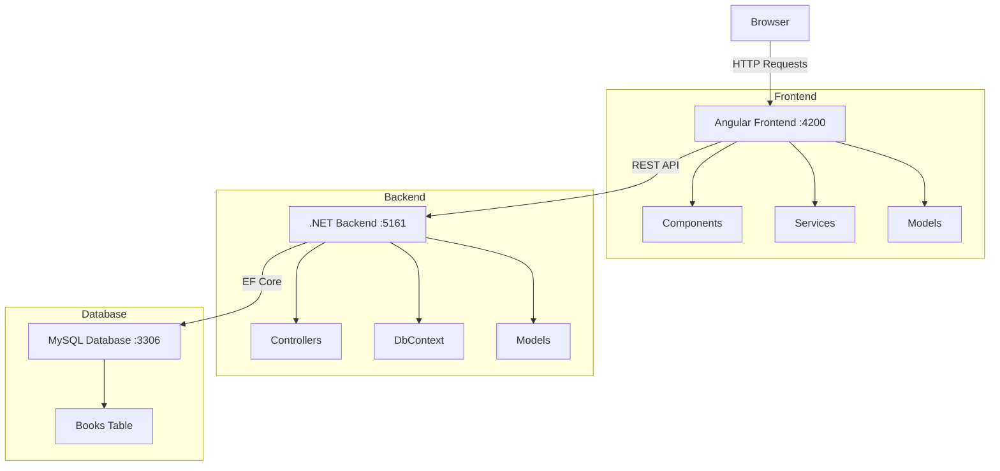
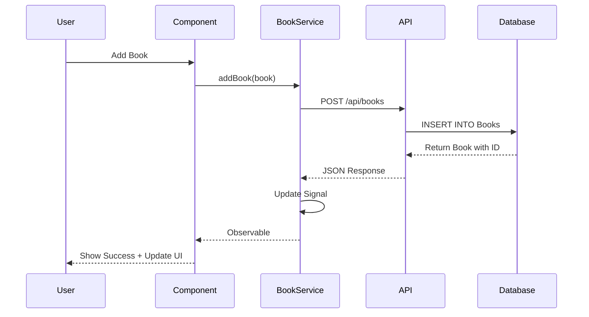
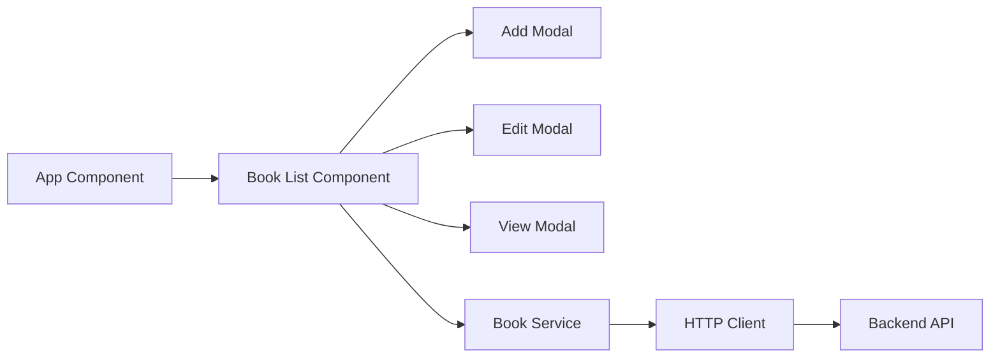
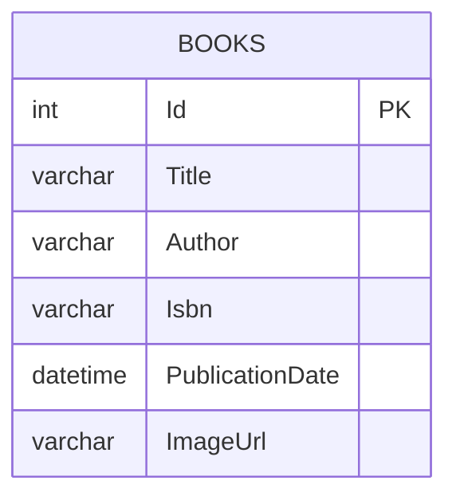

# Book Manager - Full Stack Application

A modern book management system built with Angular 21 and .NET 10, featuring drag-and-drop image uploads and real-time data synchronization.

## Table of Contents

- [Architecture](#architecture)
- [Technology Stack](#technology-stack)
- [Quick Start](#quick-start)
- [API Endpoints](#api-endpoints)
- [Configuration](#configuration)
- [Project Structure](#project-structure)
- [Troubleshooting](#troubleshooting)

## Architecture

### System Overview



### Data Flow



### Component Architecture



## Technology Stack

### Frontend
- Angular 21 (Standalone Components)
- TypeScript 5.9
- Angular Signals (State Management)
- RxJS (Reactive Programming)
- SweetAlert2 (Notifications)
- Vite (Dev Server)

### Backend
- .NET 10 Web API
- Entity Framework Core 9
- C# 13
- Pomelo MySQL Provider
- Scalar (API Documentation)

### Database
- MySQL 8.0+
- InnoDB Engine

## Quick Start

### Prerequisites

```bash
# Required Software
- .NET 10 SDK
- Node.js 20+
- MySQL Server 8.0+

# Verify Installation
dotnet --version    # Should show 10.x
node --version      # Should show 20.x
mysql --version     # Should show 8.x
```

### Installation Steps

**1. Clone Repository**
```bash
git clone <repository-url>
cd BookStore
```

**2. Setup Backend**
```bash
cd books-backend/books-backend

# Restore dependencies
dotnet restore

# Update database
dotnet ef database update

# Run backend
dotnet run
```
Backend runs on: http://localhost:5161

**3. Setup Frontend**
```bash
cd books-angular/book-manager

# Install dependencies
npm install

# Run frontend
npm start
```
Frontend runs on: http://localhost:4200

### Automated Start Scripts

**Windows:**
```bash
start-dev.bat
```

**Linux/Mac:**
```bash
chmod +x start-dev.sh
./start-dev.sh
```

## API Endpoints

### Books API

| Method | Endpoint | Description | Request | Response |
|--------|----------|-------------|---------|----------|
| GET | `/api/books` | Get all books | - | Book[] |
| GET | `/api/books/{id}` | Get book by ID | - | Book |
| POST | `/api/books` | Create book | Book | Book |
| PUT | `/api/books/{id}` | Update book | Book | 204 |
| DELETE | `/api/books/{id}` | Delete book | - | 204 |
| POST | `/api/books/upload-image/{id}` | Upload image | FormData | ImageUrl |

### Book Model

```typescript
interface Book {
  id: number;
  title: string;
  author: string;
  isbn: string;
  publicationDate: string;
  imageUrl?: string;
}
```

### Example Requests

**Create Book:**
```bash
curl -X POST http://localhost:5161/api/books \
  -H "Content-Type: application/json" \
  -d '{
    "title": "Clean Code",
    "author": "Robert C. Martin",
    "isbn": "9780132350884",
    "publicationDate": "2008-08-01"
  }'
```

**Upload Image:**
```bash
curl -X POST http://localhost:5161/api/books/upload-image/1 \
  -F "file=@cover.jpg"
```

## Configuration

### Backend Configuration

The backend uses environment variables for sensitive data like database credentials.

**Step 1: Create .env file**

Copy the example file and update with your credentials:

```bash
cd books-backend/books-backend
cp .env.example .env
```

**Step 2: Edit .env file**

```env
# Database Configuration
DB_SERVER=localhost
DB_PORT=3306
DB_NAME=booksdb
DB_USER=your_username
DB_PASSWORD=your_password
```

**Note:** The .env file is gitignored and should never be committed to version control.

**appsettings.json** (No sensitive data):
```json
{
  "Logging": {
    "LogLevel": {
      "Default": "Information",
      "Microsoft.AspNetCore": "Warning"
    }
  },
  "AllowedHosts": "*"
}
```

### Frontend Configuration

**Development:** `src/environments/environment.ts`
```typescript
export const environment = {
  production: false,
  apiUrl: '/api',
  baseUrl: 'http://localhost:5161'
};
```

**Production:** `src/environments/environment.prod.ts`
```typescript
export const environment = {
  production: true,
  apiUrl: 'https://api.yourdomain.com/api',
  baseUrl: 'https://api.yourdomain.com'
};
```

### Proxy Configuration

**File:** `books-angular/book-manager/proxy.conf.json`

```json
{
  "/api": {
    "target": "http://localhost:5161",
    "secure": false,
    "changeOrigin": true
  }
}
```

## Project Structure

```
BookStore/
├── books-angular/book-manager/          # Frontend
│   ├── src/app/
│   │   ├── components/
│   │   │   └── book-list/              # Main component
│   │   ├── models/
│   │   │   └── book.model.ts           # Book interface
│   │   ├── services/
│   │   │   └── book.service.ts         # HTTP service
│   │   └── environments/               # Config files
│   ├── proxy.conf.json                 # Dev proxy
│   └── package.json
│
├── books-backend/books-backend/         # Backend
│   ├── Controllers/
│   │   └── BooksController.cs          # API endpoints
│   ├── Data/
│   │   └── AppDbContext.cs             # EF Core context
│   ├── Models/
│   │   └── Book.cs                     # Entity model
│   ├── wwwroot/images/                 # Uploaded images
│   ├── Program.cs                      # Entry point
│   └── appsettings.json                # Configuration
│
├── README.md
├── INTEGRATION_GUIDE.md
├── start-dev.bat
└── start-dev.sh
```

## Database Schema



**SQL Schema:**
```sql
CREATE TABLE Books (
    Id INT PRIMARY KEY AUTO_INCREMENT,
    Title VARCHAR(255) NOT NULL,
    Author VARCHAR(255) NOT NULL,
    Isbn VARCHAR(50) NOT NULL,
    PublicationDate DATETIME NOT NULL,
    ImageUrl VARCHAR(500) NULL
);
```

## Features

### Book Management
- Create, read, update, delete books
- Real-time data synchronization
- Form validation

### Image Upload
- Drag and drop support
- Click to browse
- Image preview
- Automatic upload to server

### User Interface
- Alphabetical filtering (A-Z)
- Search by title/author
- Cover and list view modes
- Responsive design
- Modal dialogs

## Troubleshooting

### Common Issues

**Backend not starting:**
```bash
# Check if port 5161 is in use
netstat -ano | findstr :5161

# Kill process if needed
taskkill /PID <process_id> /F

# Restart backend
dotnet run
```

**Database connection error:**
```bash
# Check MySQL is running
mysql -u root -p

# Verify connection string in appsettings.json
# Run migrations
dotnet ef database update
```

**Frontend build errors:**
```bash
# Clear cache and reinstall
rm -rf node_modules
npm install

# Clear Angular cache
rm -rf .angular
```

**CORS errors:**
- Verify backend CORS policy includes frontend URL
- Check proxy.conf.json configuration
- Ensure backend is running before frontend

**Images not loading:**
- Check wwwroot/images folder exists
- Verify file permissions
- Check image URL in database

## Building for Production

### Backend
```bash
cd books-backend/books-backend
dotnet publish -c Release -o ./publish
```

### Frontend
```bash
cd books-angular/book-manager
npm run build
# Output in dist/ folder
```

## Testing

### Backend Tests
```bash
cd books-backend/books-backend
dotnet test
```

### Frontend Tests
```bash
cd books-angular/book-manager
npm test
```

### Manual Testing
1. Start both backend and frontend
2. Open http://localhost:4200
3. Test CRUD operations
4. Test image upload
5. Test search and filtering

## Additional Documentation

- **INTEGRATION_GUIDE.md** - Detailed integration information
- **ARCHITECTURE.md** - System architecture diagrams

## License

MIT License

## Support

For issues and questions, check the troubleshooting section or review the additional documentation files.
